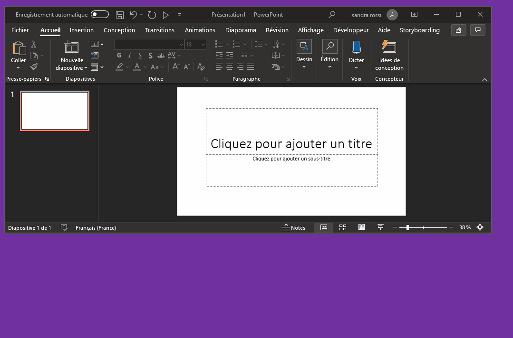

This is a Microsoft Powerpoint add-in to record your actions while you edit the PowerPoint presentation and generate a corresponding VBA macro. The add-in currently handles changes to basic shapes - See the restrictions.

# How to use PPT Macro Recorder

- Menu Add-Ins > Start recording > Dialog to choose the macro name
- Edit your PowerPoint presentation
- Menu Add-Ins > Stop recording
- Menu Developer > Visual Basic Editor > module NewMacros
  
Sum-up in this animated GIF:



# Example of generated code

```
Sub Macro1()
'
' Macro1 Macro
'
    With Application.ActivePresentation.Slides.Item(1).Shapes
        Set MyShape = .AddShape(Type:=msoShapeRectangle, Left:=74.66669, Top:=19.33331, Width:=185.3333, Height:=164)
        With MyShape
            With .Fill
                Call .Solid
                .BackColor.RGB = RGB(255, 255, 255)
                .ForeColor.ObjectThemeColor = Office.msoThemeColorAccent1
            End With
            With .Line
                .BackColor.RGB = RGB(255, 255, 255)
                .DashStyle = msoLineSolid
                With .ForeColor
                    .ObjectThemeColor = Office.msoThemeColorAccent1
                    .TintAndShade = -0.5
                End With
                .Style = msoLineSingle
                .Weight = 1
            End With
            .Name = "Rectangle 3"
            With .TextFrame2
                .HorizontalAnchor = Office.msoAnchorNone
                .MarginBottom = 3.6
                .MarginLeft = 7.2
                .MarginRight = 7.2
                .MarginTop = 3.6
                .Orientation = Office.msoTextOrientationHorizontal
                With .TextRange
                    With .Font
                        With .Fill
                            .BackColor.RGB = RGB(255, 255, 255)
                            .ForeColor.ObjectThemeColor = Office.msoThemeColorLight1
                            .Visible = msoTrue
                        End With
                        .Kerning = 12
                        .Name = "Calibri"
                        .NameAscii = "Calibri"
                        .NameComplexScript = "+mn-cs"
                        .NameFarEast = "+mn-ea"
                        .NameOther = "Calibri"
                        .Size = 18
                    End With
                    .LanguageID = Office.msoLanguageIDFrench
                End With
                .VerticalAnchor = msoAnchorMiddle
                .WordWrap = msoTrue
            End With
        End With
    End With
End Sub
```

# Installation

- Click the button DOWNLOAD CODE to get the ZIP of github repository
- Open the ZIP file and extract the file `macro recorder.ppam` to any download directory
- Start POWERPOINT
- Menu File > Options > Trust Center > Parameters > Macro parameters > Allow access to VBA Project Object Model
- Menu File > Options > Trust Center > Parameters > Add-Ins > uncheck "deactivation of all add-ins", uncheck "signature required"
- Menu File > Options > Add-Ins > PowerPoint Add-Ins > Add new... > select `macro recorder.ppam` from the download directory

You should now see the tab `Add-ins` with one button `Start recording`. It's a toggle button which can be either start or stop.

# Supported elements

- General limits
  - The tests are done on Office 365 version 16.0 build 13127.
  - The add-in is written in VBA. VBA cannot read some elements and properties from the PowerPoint Object Model, like for instance the background textures. There are also a few VBA errors like gradient colors where the colors are rendered a little differently.
  - To overcome these limits, the only possibility would be to read the saved PowerPoint file, which is not the goal of the add-in, so we have to live with that.
- Supported elements
  - Support of basic shapes: background color, transparence, lines (dash, solid), text.
- Release changes
  - 0.1.0 (initial)
- Support
  - Lots of elements are not supported yet, so please don't post issues concerning them. See this detailed list of [supported elements](supported elements.md).
